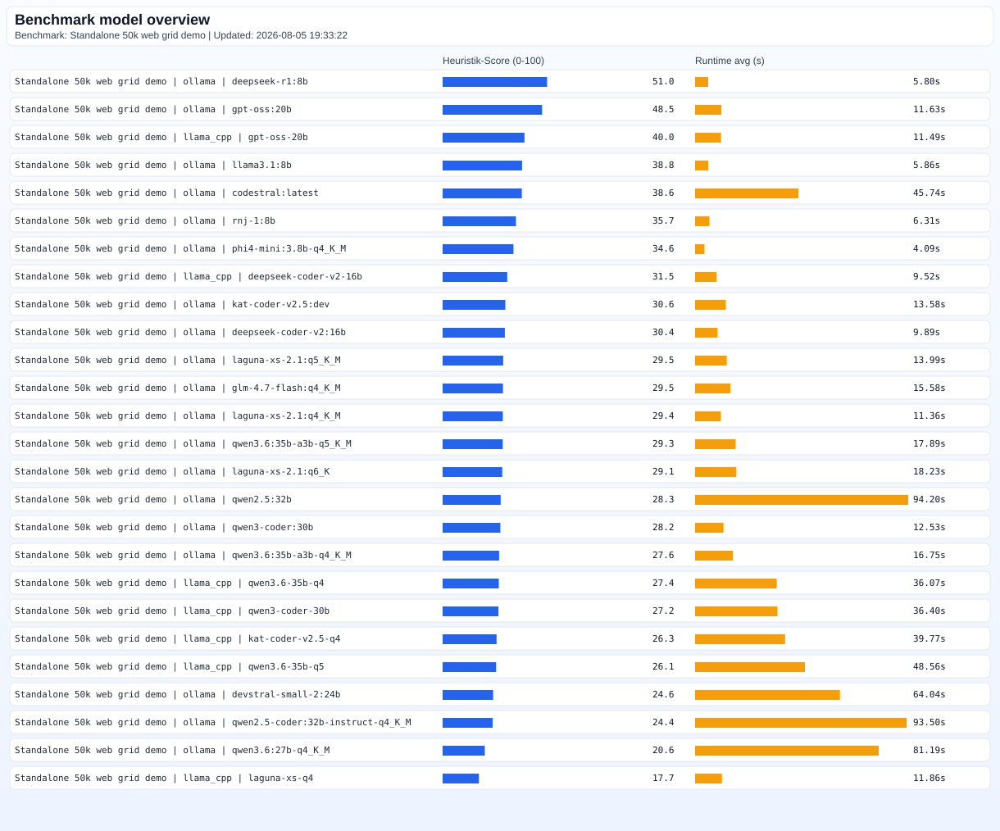

# Benchmark Report

- Generated: `2026-08-05 19:33:22`
- Source files: `1` CSV
- Total testcase runs: `71`
- Overall progress: `71/71`
- Overall ETA left: `00:00:00`
- Benchmark name(s): `Clean multi-backend model screening`
- Benchmark fixture(s): `Standalone 50k web grid demo`
- Benchmark version(s): `2026-08-01`
- Benchmark script(s): `C:\Users\z000g9hu\OneDrive - Siemens AG\GIT\llm-evaluation-workbench\benchmarks\web-grid-demo-v1.json`
- Benchmark task count(s): `1`
- Score semantics: `Heuristik-Score (keyword/rule-basiert, nicht SWE-offizieller Pass/Fail-Score)`

## Model runtime and heuristik-score chart

## Live benchmark status

- Bulk/campaign started: `05:11:57`
- Elapsed total: `00:33:22`
- Elapsed left (estimated): `00:00:00`
- Estimated total duration: `00:33:22`
- Estimated finish: `06:07:38`

<table>
<thead><tr><th>Benchmark</th><th>Backend</th><th>Model</th><th>Status</th><th>Planned start</th><th>Run started</th><th>Last update</th><th>Progress</th><th>Elapsed time</th><th>Elapsed left (est.)</th><th>ETA end</th><th>LLM start (s)</th><th>LLM stop (s)</th><th>Heuristik-Score</th><th>Gesamtbewertung</th><th>Tok/s</th><th>CPU%(avg)</th><th>GPU%(avg)</th><th>RAM GB(proc avg)</th><th>VRAM GB(avg)</th><th>Wall-s(avg)</th></tr></thead>
<tbody>
<tr><td>Standalone 50k web grid demo</td><td>llama_cpp</td><td>laguna-xs-q4</td><td>error</td><td>06:04:01</td><td>06:04:01</td><td>06:07:38</td><td>1/1</td><td>00:00:11</td><td></td><td></td><td>125.977</td><td>0.942</td><td>17.71</td><td>Not suitable</td><td>21.59</td><td>63.49</td><td>34.64</td><td>18.81</td><td>4.57</td><td>11.86</td></tr>
<tr><td>Standalone 50k web grid demo</td><td>llama_cpp</td><td>gpt-oss-20b</td><td>done</td><td>05:59:58</td><td>05:59:58</td><td>06:07:13</td><td>1/1</td><td>00:00:22</td><td>00:00:00</td><td>19:33:22</td><td>8.369</td><td>0.960</td><td>39.95</td><td>Not suitable</td><td>45.33</td><td>41.08</td><td>55.90</td><td>11.28</td><td>7.05</td><td>11.49</td></tr>
<tr><td>Standalone 50k web grid demo</td><td>llama_cpp</td><td>deepseek-coder-v2-16b</td><td>done</td><td>05:59:40</td><td>05:59:40</td><td>06:06:48</td><td>1/1</td><td>00:00:19</td><td>00:00:00</td><td>19:33:22</td><td>9.892</td><td>0.903</td><td>31.54</td><td>Not suitable</td><td>28.75</td><td>62.89</td><td>50.47</td><td>10.01</td><td>6.93</td><td>9.52</td></tr>
<tr><td>Standalone 50k web grid demo</td><td>llama_cpp</td><td>qwen3-coder-30b</td><td>done</td><td>05:59:16</td><td>05:59:16</td><td>06:06:29</td><td>1/1</td><td>00:01:12</td><td>00:00:00</td><td>19:33:22</td><td>22.834</td><td>2.056</td><td>27.24</td><td>Not suitable</td><td>9.20</td><td>43.75</td><td>64.92</td><td>21.86</td><td>7.12</td><td>36.40</td></tr>
<tr><td>Standalone 50k web grid demo</td><td>llama_cpp</td><td>qwen3.6-35b-q5</td><td>done</td><td>05:57:42</td><td>05:57:42</td><td>06:05:56</td><td>1/1</td><td>00:01:37</td><td>00:00:00</td><td>19:33:22</td><td>25.919</td><td>3.298</td><td>26.10</td><td>Not suitable</td><td>9.92</td><td>42.27</td><td>65.84</td><td>31.53</td><td>7.17</td><td>48.56</td></tr>
<tr><td>Standalone 50k web grid demo</td><td>llama_cpp</td><td>qwen3.6-35b-q4</td><td>done</td><td>05:55:35</td><td>05:55:35</td><td>06:05:27</td><td>1/1</td><td>00:01:12</td><td>00:00:00</td><td>19:33:22</td><td>20.259</td><td>2.817</td><td>27.39</td><td>Not suitable</td><td>11.70</td><td>38.49</td><td>66.49</td><td>25.81</td><td>6.94</td><td>36.07</td></tr>
<tr><td>Standalone 50k web grid demo</td><td>llama_cpp</td><td>kat-coder-v2.5-q4</td><td>done</td><td>05:54:00</td><td>05:54:00</td><td>06:05:03</td><td>1/1</td><td>00:01:19</td><td>00:00:00</td><td>19:33:22</td><td>19.707</td><td>2.806</td><td>26.31</td><td>Not suitable</td><td>11.27</td><td>40.43</td><td>65.23</td><td>24.99</td><td>6.93</td><td>39.77</td></tr>
<tr><td>Standalone 50k web grid demo</td><td>ollama</td><td>devstral-small-2:24b</td><td>done</td><td>05:43:05</td><td>05:43:05</td><td>05:45:06</td><td>3/3</td><td>00:03:12</td><td>00:00:00</td><td>19:33:22</td><td>18.565</td><td>0.074</td><td>24.64</td><td>Not suitable</td><td>4.36</td><td>62.08</td><td>31.94</td><td>8.00</td><td>10.29</td><td>64.04</td></tr>
<tr><td>Standalone 50k web grid demo</td><td>ollama</td><td>codestral:latest</td><td>done</td><td>05:40:05</td><td>05:40:05</td><td>05:41:33</td><td>3/3</td><td>00:02:17</td><td>00:00:00</td><td>19:33:22</td><td>12.852</td><td>0.053</td><td>38.65</td><td>Not suitable</td><td>6.05</td><td>62.60</td><td>28.32</td><td>6.52</td><td>10.29</td><td>45.74</td></tr>
<tr><td>Standalone 50k web grid demo</td><td>ollama</td><td>qwen2.5-coder:32b-instruct-q4_K_M</td><td>done</td><td>05:36:04</td><td>05:36:04</td><td>05:39:00</td><td>3/3</td><td>00:04:40</td><td>00:00:00</td><td>19:33:22</td><td>25.308</td><td>0.058</td><td>24.41</td><td>Not suitable</td><td>2.95</td><td>63.04</td><td>19.12</td><td>13.65</td><td>10.46</td><td>93.50</td></tr>
<tr><td>Standalone 50k web grid demo</td><td>ollama</td><td>qwen2.5:32b</td><td>done</td><td>05:30:54</td><td>05:30:54</td><td>05:33:52</td><td>3/3</td><td>00:04:42</td><td>00:00:00</td><td>19:33:22</td><td>26.396</td><td>0.075</td><td>28.33</td><td>Not suitable</td><td>2.93</td><td>63.84</td><td>20.44</td><td>13.64</td><td>10.43</td><td>94.20</td></tr>
<tr><td>Standalone 50k web grid demo</td><td>ollama</td><td>rnj-1:8b</td><td>done</td><td>05:28:30</td><td>05:28:30</td><td>05:28:40</td><td>3/3</td><td>00:00:18</td><td>00:00:00</td><td>19:33:22</td><td>6.460</td><td>0.069</td><td>35.75</td><td>Not suitable</td><td>61.71</td><td>22.65</td><td>73.35</td><td>1.10</td><td>7.17</td><td>6.31</td></tr>
<tr><td>Standalone 50k web grid demo</td><td>ollama</td><td>deepseek-r1:8b</td><td>done</td><td>05:28:02</td><td>05:28:02</td><td>05:28:12</td><td>3/3</td><td>00:00:17</td><td>00:00:00</td><td>19:33:22</td><td>5.780</td><td>0.062</td><td>50.95</td><td>Not suitable</td><td>64.78</td><td>14.79</td><td>74.19</td><td>1.03</td><td>7.30</td><td>5.80</td></tr>
<tr><td>Standalone 50k web grid demo</td><td>ollama</td><td>llama3.1:8b</td><td>done</td><td>05:27:36</td><td>05:27:36</td><td>05:27:46</td><td>3/3</td><td>00:00:17</td><td>00:00:00</td><td>19:33:22</td><td>6.161</td><td>0.053</td><td>38.77</td><td>Not suitable</td><td>68.79</td><td>33.64</td><td>61.97</td><td>0.89</td><td>6.66</td><td>5.86</td></tr>
<tr><td>Standalone 50k web grid demo</td><td>ollama</td><td>phi4-mini:3.8b-q4_K_M</td><td>done</td><td>05:27:11</td><td>05:27:11</td><td>05:27:18</td><td>3/3</td><td>00:00:12</td><td>00:00:00</td><td>19:33:22</td><td>4.522</td><td>0.071</td><td>34.56</td><td>Not suitable</td><td>108.51</td><td>32.44</td><td>51.31</td><td>1.09</td><td>4.82</td><td>4.09</td></tr>
<tr><td>Standalone 50k web grid demo</td><td>ollama</td><td>glm-4.7-flash:q4_K_M</td><td>done</td><td>05:26:37</td><td>05:26:37</td><td>05:26:58</td><td>3/3</td><td>00:00:46</td><td>00:00:00</td><td>19:33:22</td><td>24.028</td><td>0.078</td><td>29.46</td><td>Not suitable</td><td>28.35</td><td>50.44</td><td>26.91</td><td>8.94</td><td>9.50</td><td>15.58</td></tr>
<tr><td>Standalone 50k web grid demo</td><td>ollama</td><td>laguna-xs-2.1:q6_K</td><td>done</td><td>05:25:21</td><td>05:25:21</td><td>05:25:44</td><td>3/3</td><td>00:00:54</td><td>00:00:00</td><td>19:33:22</td><td>26.774</td><td>0.050</td><td>29.06</td><td>Not suitable</td><td>26.34</td><td>52.60</td><td>30.16</td><td>18.06</td><td>9.94</td><td>18.23</td></tr>
<tr><td>Standalone 50k web grid demo</td><td>ollama</td><td>laguna-xs-2.1:q5_K_M</td><td>done</td><td>05:24:02</td><td>05:24:02</td><td>05:24:20</td><td>3/3</td><td>00:00:41</td><td>00:00:00</td><td>19:33:22</td><td>22.059</td><td>0.048</td><td>29.54</td><td>Not suitable</td><td>37.20</td><td>56.06</td><td>31.34</td><td>13.44</td><td>9.97</td><td>13.99</td></tr>
<tr><td>Standalone 50k web grid demo</td><td>ollama</td><td>laguna-xs-2.1:q4_K_M</td><td>done</td><td>05:23:00</td><td>05:23:00</td><td>05:23:12</td><td>3/3</td><td>00:00:34</td><td>00:00:00</td><td>19:33:22</td><td>23.035</td><td>0.047</td><td>29.37</td><td>Not suitable</td><td>48.14</td><td>56.94</td><td>31.61</td><td>10.08</td><td>9.85</td><td>11.36</td></tr>
<tr><td>Standalone 50k web grid demo</td><td>ollama</td><td>gpt-oss:20b</td><td>done</td><td>05:21:58</td><td>05:21:58</td><td>05:22:12</td><td>3/3</td><td>00:00:34</td><td>00:00:00</td><td>19:33:22</td><td>18.325</td><td>0.105</td><td>48.54</td><td>Not suitable</td><td>41.85</td><td>48.00</td><td>31.44</td><td>4.09</td><td>9.18</td><td>11.63</td></tr>
<tr><td>Standalone 50k web grid demo</td><td>ollama</td><td>deepseek-coder-v2:16b</td><td>done</td><td>05:21:01</td><td>05:21:01</td><td>05:21:17</td><td>3/3</td><td>00:00:29</td><td>00:00:00</td><td>19:33:22</td><td>11.734</td><td>0.074</td><td>30.37</td><td>Not suitable</td><td>36.76</td><td>57.25</td><td>30.54</td><td>3.70</td><td>9.49</td><td>9.89</td></tr>
<tr><td>Standalone 50k web grid demo</td><td>ollama</td><td>qwen3-coder:30b</td><td>done</td><td>05:20:09</td><td>05:20:09</td><td>05:20:33</td><td>3/3</td><td>00:00:37</td><td>00:00:00</td><td>19:33:22</td><td>21.721</td><td>0.055</td><td>28.16</td><td>Not suitable</td><td>31.65</td><td>45.00</td><td>21.91</td><td>9.01</td><td>9.38</td><td>12.53</td></tr>
<tr><td>Standalone 50k web grid demo</td><td>ollama</td><td>qwen3.6:35b-a3b-q5_K_M</td><td>done</td><td>05:19:09</td><td>05:19:09</td><td>05:19:30</td><td>3/3</td><td>00:00:53</td><td>00:00:00</td><td>19:33:22</td><td>27.976</td><td>0.075</td><td>29.32</td><td>Not suitable</td><td>30.26</td><td>51.83</td><td>27.61</td><td>15.10</td><td>9.57</td><td>17.89</td></tr>
<tr><td>Standalone 50k web grid demo</td><td>ollama</td><td>qwen3.6:35b-a3b-q4_K_M</td><td>done</td><td>05:17:45</td><td>05:17:45</td><td>05:18:06</td><td>3/3</td><td>00:00:50</td><td>00:00:00</td><td>19:33:22</td><td></td><td>0.090</td><td>27.55</td><td>Not suitable</td><td>31.57</td><td>49.02</td><td>28.96</td><td>12.85</td><td>9.75</td><td>16.75</td></tr>
<tr><td>Standalone 50k web grid demo</td><td>ollama</td><td>qwen3.6:27b-q4_K_M</td><td>done</td><td>05:14:10</td><td>05:14:10</td><td>05:16:42</td><td>3/3</td><td>00:04:03</td><td>00:00:00</td><td>19:33:22</td><td>24.491</td><td>0.098</td><td>20.57</td><td>Not suitable</td><td>3.45</td><td>61.81</td><td>26.75</td><td>8.95</td><td>10.51</td><td>81.19</td></tr>
<tr><td>Standalone 50k web grid demo</td><td>ollama</td><td>kat-coder-v2.5:dev</td><td>done</td><td>05:11:57</td><td>05:11:57</td><td>05:12:11</td><td>3/3</td><td>00:00:40</td><td>00:00:00</td><td>19:33:22</td><td>23.748</td><td>0.073</td><td>30.61</td><td>Not suitable</td><td>43.25</td><td>49.37</td><td>29.02</td><td>10.59</td><td>9.45</td><td>13.58</td></tr>
</tbody></table>

- Detailed run-plan report: `benchmark_report_details.md`
